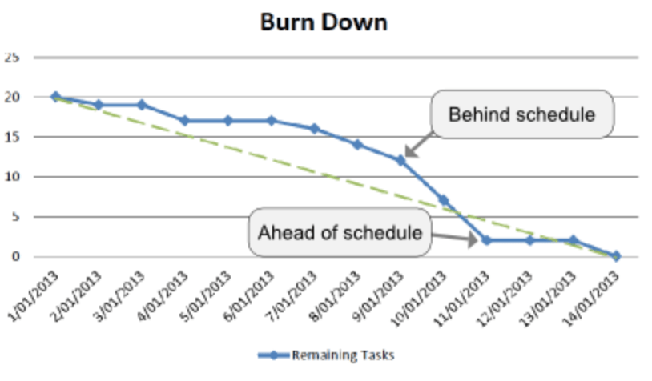
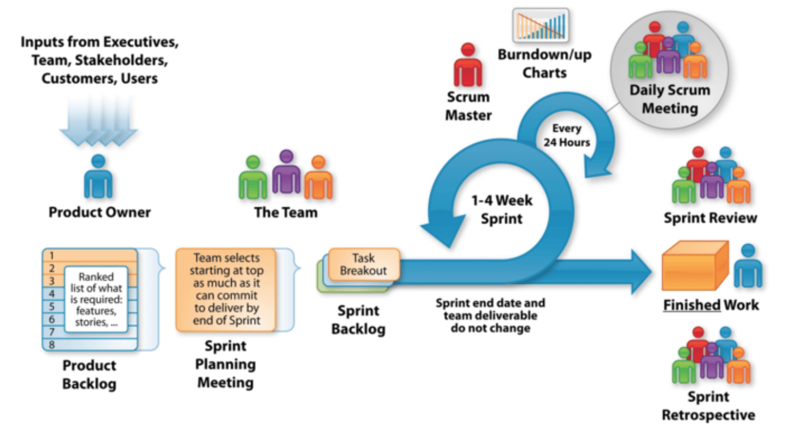

[← Terug](/)

# Scrum

> Scrum is een flexibele manier om (software)producten te maken. Er wordt gewerkt in multidisciplinaire teams die in korte sprints, met een vaste lengte van 1 tot 4 weken, werkende (software) producten opleveren.
> ([Wikipedia](https://nl.wikipedia.org/wiki/Scrum_(softwareontwikkelmethode)))

Scrum dankt haar naam aan een term uit de rugbysport. De vergelijking is ooit gelegd door de manier waarop een rugbyteam als groep de achterlijn van de tegenstander probeert te bereiken. Hierbij is samenwerking, aanpassingsvermogen, snelheid en zelfsturing van cruciaal belang. Deze elementen zijn vrijwel identiek aan die van multidisciplinaire teams die websites of software ontwikkelen.

Scrum is al jaren een stijgende trend en heeft zich inmiddels al bij vele organisaties bewezen. Officieel bestaat het sinds 1995. Het komt voort uit een Amerikaans onderzoek waaruit bleek dat projecten met kleine (multidisciplinaire) teams historisch gezien het beste resultaat leveren.

Al vanaf 2001 is de methode op grote schaal omarmd door vooraanstaande multinationals, zoals Google, Amazon, Microsoft en Nokia. Scrum is inmiddels een bewezen methode en is in software ontwikkeling niet meer weg te denken.

Het basisprincipe van Scrum (in het Engels) is: Manage Complexity, Unpredictability and Change through Visibility, Inspection and Adaption. In de praktijk (en in het Nederlands) betekent dit dat er vanuit het Scrum manifest gekozen wordt voor…

- **Mensen en hun onderlinge interactie** *boven* processen en hulpmiddelen
- **Werkende software** *boven* allesomvattende documentatie
- **Samenwerking met de klant** *boven* contractonderhandelingen
- **Inspelen op verandering** *boven* het volgen van een plan

En hoewel Scrum waardering heeft voor al hetgeen aan de rechterkant staat vermeld (veelal onderdelen van de watervalmethode), hecht Scrum méér waarde aan wat aan de linkerzijde wordt genoemd.

## Wat is het resultaat van de Scrum methode?

Met de Scrum methode worden onderstaande punten minimaal nagestreefd.

- Zoveel mogelijk waarde creëren
- Transparantie en kwaliteit
- Een constant tempo **(van ontwikkeling)** vasthouden
- Regelmatige reflectie/evaluatie
- Regelmatige oplevering van werkende software
- Teamwork en gemotiveerde mensen

## De User Stories

### Inleiding

Een user story is een korte beschrijving (story) van wat een gebruiker (user) wil. User stories hebben een zeer prominente rol binnen Scrum. Een user story bestaat uit enkele zinnen gewone spreektaal van de gebruiker waarin staat wat de gebruiker doet of moet doen, als onderdeel van z'n werk. Deze user stories worden gebruikt binnen agile software development als een manier om de requirements te beschrijven. Hierin zegt men 'wie', 'wat', 'waarom' wil. Het geheel is weinig gedetailleerd en moet passen op een post-it. Het is de belangrijkste manier waarop de gebruiker invloed heeft op de functionaliteit van het te ontwikkelen systeem of product. 

Een goede user story bevat minimaal de volgende informatie:

Een user story bevat veel informatie maar is meestal minder diepgaand dan wanneer u een nieuwe functionaliteit in een functioneel ontwerp zou beschrijven. Daar zit dan ook net de crux; om genoeg vrijheid te behouden voor het Scrum team om eigen inbreng te tonen.

Scrum gaat namelijk uit van de expertise en professionaliteit van de ontwikkelaars om op basis van een user story iets nieuws te bouwen. Maar het gaat ook uit van de feedbackloop met de opdrachtgever waardoor het resultaat snel geoptimaliseerd kan worden en écht aansluit op uw behoefte.

User stories worden meestal door de productowner geschreven of verfijnd en gebeuren zoveel mogelijk in samenspraak met de stakeholders van het project (u als klant). Als voor een nieuw project de user stories compleet zijn en u heeft ze als opdrachtgever goedgekeurd, dan kunnen ze ingeschat worden door het Scrum team. 

De user stories worden opgeknipt in taken. Taken worden met behulp van story points ingeschat. Bij het inschatten wordt gebruik gemaakt van de Fibonacci reeks: 0, ½, 1, 2, 3, 5, 8, en 13 punten. Zodra een taak op meer dan 20 punten geschat wordt, is het doorgaans te groot en moet de taak opgeknipt worden in kleinere brokken.

Het inschatten van nieuwe user stories gebeurt periodiek in de Sprint Planning Meeting. Het hele Scrum team doet mee waarbij de gezamenlijke kennis & ervaring wordt ingezet om tot een reële en gedragen inschatting te komen. Dit ‘relatief schatten’ is makkelijker en betrouwbaarder dan schatten in uren.

Tijdens de sprintwisseldag worden de user stories voor de volgende sprint besproken en geprioriteerd. Hoeveel user stories er kunnen worden afgewerkt kan grofweg ingeschat worden op basis van de velocity van het team.

### Velocity

Velocity is een zeer eenvoudige, krachtige methode voor het nauwkeurig meten van de snelheid waarmee Scrum ontwikkelingsteams voortgang boeken binnen de ontwikkeling van het product. 

Er zijn een aantal richtlijnen voor het schatten van de beginsnelheid van uw Scrum team voorafgaand aan het voltooien van de eerste sprint (er is dan nog geen historie bekend om de velocity te meten), maar binnen een korte tijd, stabiliseert de snelheid meestal en geeft dit een goede basis voor het verbeteren van de nauwkeurigheid en betrouwbaarheid van zowel de korte als lange termijn van uw Scrum project. 

### Burndown chart

Het monitoren van de ontwikkel snelheid binnen een Scrum team wordt gedaan middels een visuele grafiek genaamd de Burndown chart. Deze grafiek laat de nog openstaande storypoints zien ten opzichte van de reeds verstreken tijd. Op deze manier is goed in te schatten of het team voldoende (of juist) teveel werk in de huidige sprint heeft zitten. Dit continu monitoren van het proces draagt bij aan nauwkeurigere inschattingen en vergroten van de haalbaarheid van de hoeveelheid werk binnen de sprint.

## De voorbereiding: Sprint 0

In het voortraject - de zogenaamde sprint 0 - onderzoeken we uw vraag waarin het fundament voor het project grotendeels wordt vastgelegd. Na afloop van Sprint 0 dienen de volgende zaken duidelijk te zijn:

- Een globale omschrijving van wat we gaan maken (user stories uitgewerkt op hoofdlijnen).
- Een eventueel bijgestelde inschatting van het aantal sprints dat benodigd zal zijn.
- Een planning welke inzicht geeft in de doorlooptijd van het project gebaseerd op het aantal te verwachten sprints. 

### Samenstellen projectteam

Als eerste wordt in Sprint 0 het complete projectteam gevormd; De stakeholders vanuit uw zijde als klant. En vanuit Divtag de Product Owner, Scrum Master en de noodzakelijke projectleden in de vorm van een back- en/of front-end ontwikkelaars en eventuele derde partijen.

### Inrichten projectsoftware (Jira)

Alle administratieve processen worden vastgelegd in [Jira](https://nl.atlassian.com/software/jira), een online applicatie speciaal ontwikkeld voor Scrum projecten. Dit systeem is voor alle leden van het projectteam beschikbaar.

### Werken met onze aanpak
U krijgt direct een beeld van hoe de aanpak werkt. Geen lange requirement documenten, maar samen bespreken waar we naar toe willen. We gaan nog niet de diepte in, maar dagen u wel al uit om in deze fase keuzes te maken in het belang van kwaliteit, planning en uw budget. Dit doen we door op hoofdlijnen de user stories uit te werken.

### Afstemming derde partijen
De afstemming met derde partijen. Deze laten wij aansluiten aan ons proces en zorgen ervoor dat wij inzicht krijgen in hun werkwijze, producten en indien nodig regelen wij toegang tot hun software of hardware.

### Onderzoek te ontwikkelen functionaliteiten
We onderzoeken de te ontwikkelen functionaliteiten, modules of andere technische oplossingen waar onzekerheid in zit.

### Wegnemen project risico's
We nemen zoveel mogelijk project risico's weg. Alles wat de oplevering binnen het budget en planning in de weg kan staan wordt tegen het licht gehouden in Sprint 0 en waar nodig direct opgelost.

De Sprint 0 bestaat zoals u ziet niet uitsluitend uit het wegnemen van onzekerheden, maar ook het al in gereedheid brengen van basis zaken voor de realisatie. Dit zorgt ervoor dat wij direct na Sprint 0 de realisatiefase in kunnen gaan. 

### Kosten Sprint 0

De kosten voor de sprint 0, zijn inbegrepen in het project, mits deze doorgang vindt. Mocht u besluiten om na de voorbereidingsfase het project te annuleren dan worden de daadwerkelijk besteedde uren aan u doorbelast op basis van nacalculatie. De tarieven hiervoor vindt u verderop in dit voorstel.

## De werkelijke sprints (realisatiefase)

Na definitief akkoord op planning en budget (vastgesteld in sprint 0) wordt met sprint 1 de ontwikkeling gestart. Hoeveel sprints er nodig zijn hangt af van de grootte van het project. Standaard hanteren wij bij Divtag sprints van 2 weken en in elke sprint wordt hetzelfde proces herhaald:

**Voorbereiding sprint:**

Wij plannen samen welke user stories ontwikkelt gaan worden; Dit gebeurt op de sprintwisseldag in de zogenaamde sprintreview meeting.

**De sprint zelf:**

- Het Scrum team gaat aan het werk en komt dagelijks 15 minuten bij elkaar in de Daily Standup om de voortgang te bespreken.
- Het Scrum team pakt kleine brokken werk op die onafhankelijk ontwikkelt, getest en uitgeleverd kunnen worden.
- Belangrijk voor u als opdrachtgever: Aan het einde van iedere sprint houden we de Sprint Review Meeting en presenteert het Scrum team de tussentijdse resultaten (Demo van het product tot op dat moment). Dat wil zeggen, echt werkende functionaliteiten. U geeft feedback en het team kan hier weer verder aan werken.
- Het Scrum team evalueert de afgelopen sprint - de Retrospective - en bedenkt procesverbeteringen die moeten zorgen voor een hogere productiviteit en kwaliteit.

De volgende sprint begint dan weer bij stap 1.

Onderstaande afbeelding is een handige schematische weergave van dit Scrum proces:

